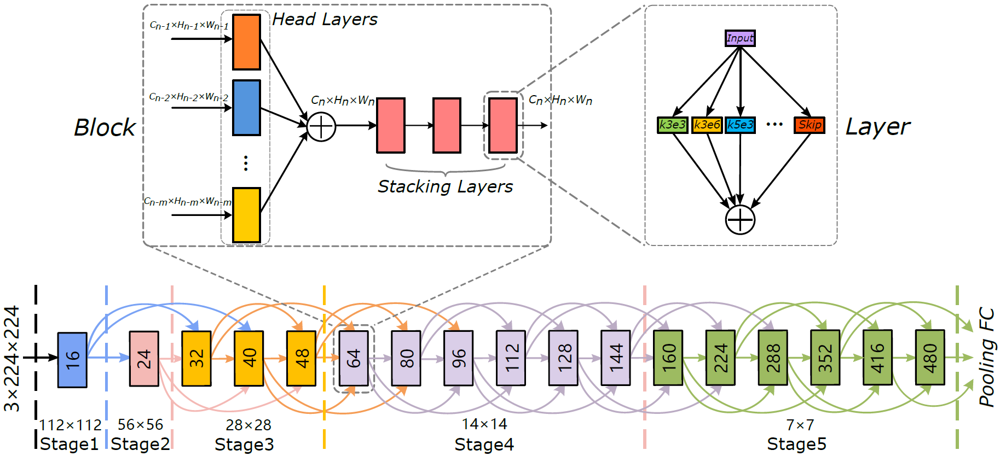
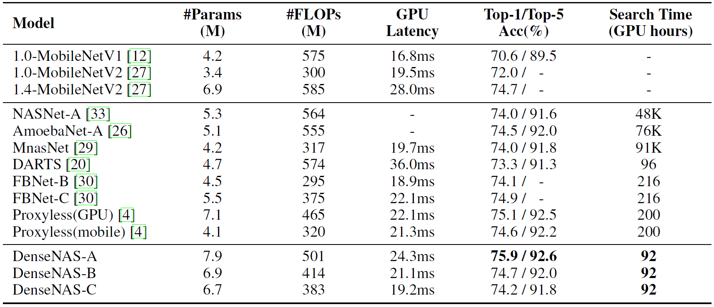
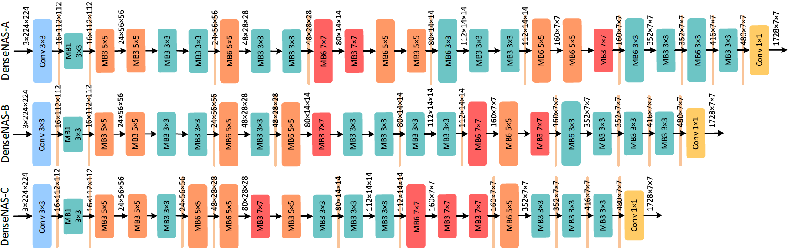

# DenseNAS
The evaluation code of the paper [Densely Connected Search Space for More Flexible Neural Architecture Search](https://arxiv.org/abs/1906.09607)

We propose a novel differentiable NAS method which can search for the width and the spatial resolution of each block simultaneously. We achieve this by constructing a densely connected search space and name our method as DenseNAS. Blocks with different width and spatial resolution combinations are densely connected to each other. The best path in the super network is selected by optimizing the transition probabilities between blocks. As a result the overall depth distribution of the network is optimized globally in a graceful manner. 

## Requirements
* pytorch 1.0.1
* python 3.6+

## Results
DenseNAS obtains an architecture with 75.9\% top-1 accuracy on ImageNet and the latency is as low as 24.3ms on a single TITAN-XP. The total search time is merely 23 hours on 4 GPUs.
Our results on ImageNet are shown bellow.

Our pretrained models can be downloaded in the following:

* [DenseNAS-A](https://drive.google.com/open?id=1INsZuwNQMiGIVdWkfh09qWPLnzxq8DUu)
* [DenseNAS-B](https://drive.google.com/open?id=1DEw9n7JFGQfSklOMJCLgH2mx6v-7Mqko)
* [DenseNAS-C](https://drive.google.com/open?id=1bFUpqp1DtFgHzwHALDoJA1rPC3hmUbIq)

## Evaluate
1. Download the related files of the pretrained model and put `net_config` and `weights.pt` into the `model_path`
2. `python validation.py --data_path 'The path to ImageNet data' --load_path 'The path you put the pretrained model'`
